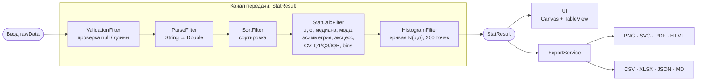
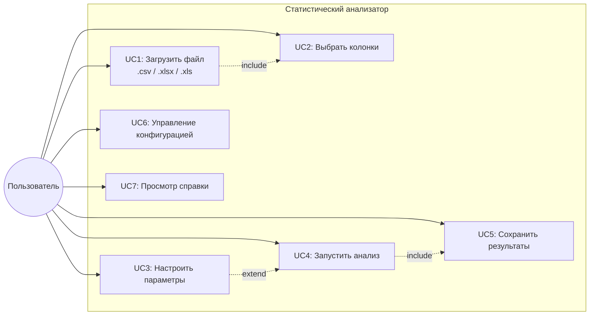
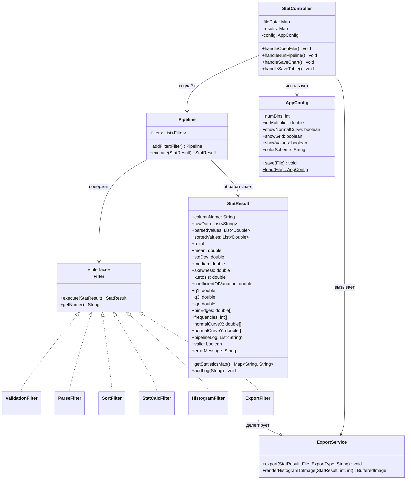
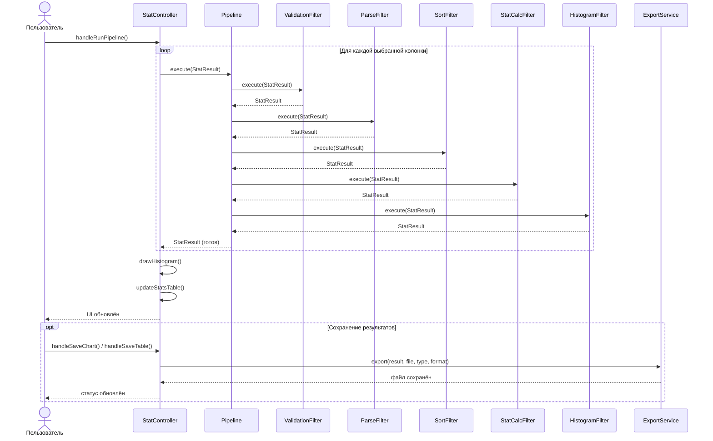
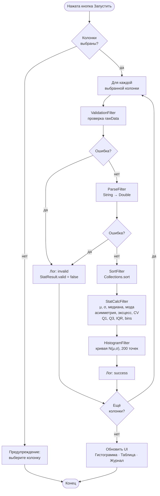

# Статистический анализатор

**Паттерн:** Каналы и фильтры (Pipes and Filters)  
**Вариант:** Анализ распределения  
**Стек:** Java 17 · JavaFX 21 · Apache POI · OpenCSV · Jackson · PDFBox

---

## Содержание

1. [Описание](#описание)
2. [Паттерн «Каналы и фильтры»](#паттерн-каналы-и-фильтры)
3. [Функционал](#функционал)
4. [Архитектура](#архитектура)
5. [Диаграммы](#диаграммы)
6. [Запуск](#запуск)
7. [Тесты](#тесты)
8. [Git-ветки и коммиты](#git-ветки-и-коммиты)

---

## Описание

Приложение загружает данные из файлов `.csv` / `.xlsx`, позволяет выбрать числовые колонки и запускает конвейер обработки: валидация → парсинг → сортировка → расчёт статистик → построение гистограммы с кривой нормального распределения. Результаты сохраняются в форматах PNG/SVG/PDF/HTML (график) и CSV/XLSX/JSON/Markdown (таблица метрик).

---

## Паттерн «Каналы и фильтры»



**Единый интерфейс фильтра:**
```java
interface Filter<T, R> {
    R execute(T input) throws FilterException;
}
```

**Канал передачи** — объект `StatResult`, который накапливает данные по мере прохождения через фильтры. Каждый фильтр получает `StatResult` на вход и возвращает обогащённый `StatResult`.

---

## Функционал

| Действие | Описание |
|---|---|
| Открыть файл | `.csv` (запятая или точка с запятой) / `.xlsx` / `.xls` |
| Выбрать колонки | Список с чекбоксами; несколько колонок одновременно |
| Настроить параметры | Число бинов (2–200), IQR-множитель, флаги отображения |
| Запустить конвейер | Последовательный запуск 5 фильтров с журналом выполнения |
| Гистограмма | Столбчатая + кривая нормального распределения (PDF) |
| Статистики | n, min/max, μ, σ, медиана, мода, асимметрия, эксцесс, CV, Q1/Q3/IQR |
| Переключение колонок | ComboBox для выбора отображаемой колонки |
| Сохранить график | PNG, SVG, PDF, HTML (с Chart.js) |
| Сохранить таблицу | CSV, XLSX (с листом частот), JSON, Markdown |
| Конфигурация | Сохранение / загрузка JSON-конфига |
| Справка | Формулы, инструкция, о программе (F1) |
| Журнал конвейера | Временны́е метки и статус каждого фильтра в UI |

---

## Архитектура

```
src/main/java/com/statanalyzer/
├── StatApp.java                    ← точка входа (Application.launch)
├── filter/
│   ├── Filter.java                 ← интерфейс Filter<T,R>
│   ├── FilterException.java        ← исключение фильтра
│   ├── ValidationFilter.java       ← проверка: не пусто, ≥3 значений
│   ├── ParseFilter.java            ← String → List<Double>
│   ├── SortFilter.java             ← сортировка по возрастанию
│   ├── StatCalcFilter.java         ← все статистики + частоты бинов
│   ├── HistogramFilter.java        ← точки кривой нормального распред.
│   └── ExportFilter.java           ← делегирует ExportService
├── model/
│   └── StatResult.java             ← канал передачи данных
├── pipeline/
│   ├── Pipeline.java               ← запуск цепочки фильтров
│   └── ExportService.java          ← экспорт в PNG/SVG/PDF/HTML/CSV/XLSX/JSON/MD
├── controller/
│   └── StatController.java         ← FXML-контроллер главного окна
└── config/
    └── AppConfig.java              ← конфигурация (сериализация в JSON)

src/main/resources/com/statanalyzer/
├── main-view.fxml                  ← главное окно
├── help-view.fxml                  ← окно справки
└── styles.css                      ← стили JavaFX

src/test/java/com/statanalyzer/
├── filter/
│   ├── ValidationFilterTest.java
│   ├── ParseFilterTest.java
│   └── StatCalcFilterTest.java
└── pipeline/
    └── PipelineIntegrationTest.java
```

---

## Диаграммы

### Use-case



### Диаграмма классов



### Диаграмма последовательностей



### Диаграмма активности (конвейер)



---

## Запуск

**Требования:** JDK 17+, Maven 3.8+

```bash
# Клонировать и перейти в проект
git clone <url> && cd statistical-analyzer

# Компиляция и запуск
mvn clean javafx:run

# Только компиляция
mvn clean compile

# Запуск тестов
mvn test
```

**IntelliJ IDEA:** File → Open → выбрать папку проекта → Run `StatApp`

---

## Тесты

| Класс теста | Группа | Что тестируется |
|---|---|---|
| `ValidationFilterTest` | Unit | null/пустые данные, граница ≥3, лог |
| `ParseFilterTest` | Unit | запятая/точка, пропуск NaN/"abc", пробелы |
| `StatCalcFilterTest` | Unit | μ, σ², σ, медиана, min/max, сумма частот = n, асимметрия симм. ≈ 0 |
| `PipelineIntegrationTest` | Integration | полный конвейер, смешанные данные, отрицательные, журнал |

```bash
# Запуск всех тестов
mvn test

# Отчёт сохраняется в target/surefire-reports/
```

---

## Git-ветки и коммиты

```
main   — стабильная версия
mvp    — минимально рабочая версия (без экспорта SVG/PDF/HTML)
```

**Рекомендуемые коммиты:**

```
feat: add Filter interface and FilterException
feat: implement ValidationFilter and ParseFilter
feat: implement SortFilter and StatCalcFilter  
feat: implement HistogramFilter (normal curve computation)
feat: implement Pipeline with step logging
feat: add ExportService (PNG, SVG, PDF, HTML, CSV, XLSX, JSON, MD)
feat: add ExportFilter delegating to ExportService
feat: add AppConfig with JSON serialization
feat: add StatController with file loading (CSV/XLSX)
feat: add main-view.fxml with histogram canvas and stats table
feat: add help-view.fxml with formulas and instructions
feat: add CSS styles
test: add unit tests for ValidationFilter, ParseFilter, StatCalcFilter
test: add integration test for full pipeline
docs: add README with diagrams and formulas
```
